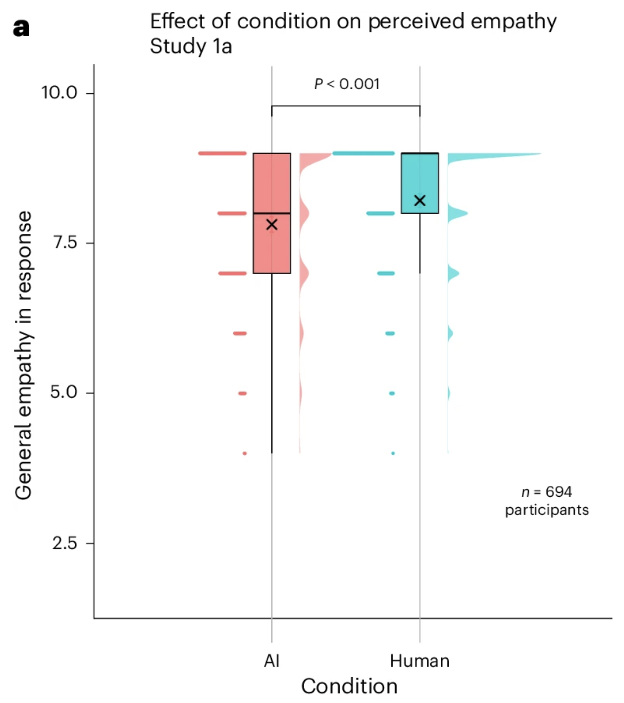
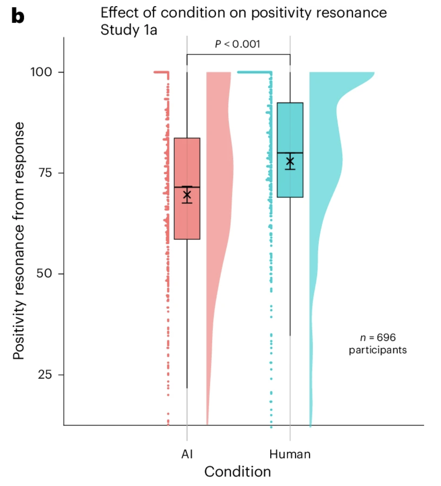

## Introduction
As AI systems proliferate, people are increasingly turning to these technologies not only as functional tools but also as relational partners. Given that these relationships can supplant offline social interactions, it is important to better understand how human–AI interactions compare to human–human interactions. In this project, I aim to replicate Study 1A from Rubin et al.’s paper “Comparing the value of perceived human versus AI-generated empathy,” published in Nature Human Behavior. In their work, Rubin et al. conduct a series of experiments to examine how the perceived source of empathy—whether from humans or AI systems—affects people’s experience of empathy. The key hypothesis of this work is that participants who believe they are receiving an AI-generated response will perceive it as less empathic compared to a response believed to be human-written. For Study 1A, participants are randomly assigned to one of two conditions: one group is told that they will receive a response generated by an AI, and the second group is told that they will receive a response from a human. Participants are then asked to describe a recent emotional experience. After 60 seconds, they are shown a response to their experience. In both conditions, the response participants see is AI-generated. Participants then rate how much empathy they felt in the response, as well as answering questions that break empathy into separate dimensions.


## Justification for Study
As a part of my PhD research, I have ongoing work focused on the relationship between AI companion usage and user well-being. In prior work, we found that interacting with AI companions on Character.AI has a negative relationship with user well-being [1]. One of the benefits of AI companions that our study participants reported was that these systems could provide emotional support and reduce loneliness; however, a detriment is that using AI companions can displace human-human relationships. Nonetheless, our current work is limited to only survey results, reporting correlations between usage and well-being. Replicating Rubin et al.'s work on perceived empathy depending on human vs. AI sources is a good first step in teasing apart more of the causal mechanisms related to my line of work. 

[1] Zhang et al. "The Rise of AI Companions: How Human-Chatbot Relationships Influence Well-Being." arXiv 2025. 

## Anticipated Challenges
There are two main challenges I anticipate with this study. The first will be developing the experimental code. The authors provide the prompts that they used to generate the AI-responses in the Methods section, but they do not provide the code for the experimental platform, which I will need to develop myself. One modification I will make from the original methods is to use GPT-4.1, which is the latest state-of-the-art non-reasoning model for generating responses, rather than GPT-4, which is no longer offered from OpenAI. The second challenge is whether I will be able to recruit a sufficient number of participants as the original study recruited ~800. While I believe recruiting this number of participants is feasible for an online study, I believe it is out-of-scope and budget for the class. Nonetheless, I ran a power analysis using the effect size (Cohen's d = 0.34) reported in the paper; to achieve a power of 80% at an alpha level of 0.05, we would need a total sample size of 350 participants (or 175 per condition). Given that the study is on the shorter-side, I believe this is feasible. Nonetheless, it is possible that my study could be underpowered.

### Repo Link 
Repository: <https://github.com/psych251/rubin2025/tree/main>

Original Paper: <https://github.com/psych251/rubin2025/blob/main/original_paper/s41562-025-02247-w.pdf> 

Experimental Paradigm: <https://stanforduniversity.qualtrics.com/jfe/form/SV_1YAwJsT5JNf428u>

Pre-registration: <https://osf.io/sncag/overview>

## Methods

### Power Analysis
In the paper, the authors report an effect size of 0.34 for a Welch's t-test on the general empathy question between the Human and AI conditions. I estimate power at 0.80, 0.90, 0.95 for the effect size in the paper as well as for a more conservative Cohen's d of 0.3.   

```{r}
library(pwr)
d_original <- 0.34
d_conservative <- 0.3

## power levels to test
powers <- list(.80, .90, .95)

## power analyses for t-tests with effect size reported in original paper
print("Cohen's d  = 0.34")
for (power in powers) {
  print(power)
  print(pwr.t.test(d = d_original, power = power, type = "two.sample"))
}

print("Cohen's d = 0.3")
for (power in powers) {
  print(power)
  print(pwr.t.test(d = d_conservative, power = power, type = "two.sample"))
}
```


### Planned Sample
Based on the power analyses for the more conservative effect size (Cohen's *d* = .30), I will collect data from 350 participants and data collection will stop once complete data from all 350 participants has been collected from Prolific. The experiment should take about 4 minutes to complete.

### Materials
The participants are asked to describe an emotional experience and then showed a response generated using a large language model (LLMs). Given the stochastic nature of LLMs and the different inputs that participants provide, the responses the model provides will vary. Nonetheless, we use the prompt provided by the authors in the SI when generating responses. 

We deviate slightly from the original work's material in that we use Gemini-2.5.-Flash to generate responses rather than GPT-4o. These models should be similar in capabilities and are both closed-sourced models. 

### Procedure	

We follow the procedure as described in the original article as follows:

"We told the participants they were paired with either an AI or another participant. The participants shared a recent emotional experience and waited for 60 seconds; they were told either that the AI was generating a response or that the other participant was writing one, depending on the experimental condition. Participants in both conditions were then shown an AI-generated response, with the AI having been prompted to respond to their specific experience and include all three aspects of empathy." 

### Analysis Plan
First, we will exclude participants who fail the attention check question in the task and those who do not provide an emotional response, which we will manually validate. Next, following Rubin et al., we removed "any participants that were more than 2.5 standard deviations away from the mean of the dependent variable for that analysis" and ensured that "all independent categorical variables were effect-coded."

The first analysis of interest is comparing which response participants found more empathic by conducting a Welch's t-test on the general empathy question between conditions. 

The second analysis is comparing which response participants found more postively resonant again by conducting a Welch's t-test on the positive resonance measure (mean across the three questions) between conditions. 

Finally, to see whether condition affected different types of empathy (e.g., cognitive, affective, motivational), we fit a " a linear mixed-effect model to predict empathy with condition, aspect of empathy (cognitive, affective, or motivational) and their interaction."

### Differences from Original Study

There are three main differences. First, we will be using a different LLM (Gemini-2.5-Flash instead of GPT 4-0613) to generate the responses. We select Gemini-2.5-Flash due to practical cost constraints with the replication study, as Gemini offers a more generous rate limit for lower tiered API accounts compared to OpenAI. We select Gemini-2.5-Flash as it is a more cost-efficient model while still having capabilities comparable to GPT-4. This change should not produce material differences given that it is a model with similar capabilities to that used in the original study. Furthermore, in the article, they also performed the same study using an open-source Llama model to find similar results. Second, we are recruiting a much smaller sample size of 350 participants in comparison to the original study, which had 725 participants. Third, we are adding an additional validation to ensure that the participants provided a description of a recent emotional event.  Since the LLM will generate a response regardless of whether the participant inputs an emotional response, we require a post-hoc verification that the participants' input matched our question. Thus, I will manually review the submitted responses and remove those that do not describe a recent event. 

### Methods Addendum (Post Data Collection)
#### Actual Sample
I recruited 348 participants on Prolific. After excluding participants who failed the attention check (N=66), did not provide an emotional response to the LLM (N=2), or did not receive a response from the LLM responding to their experience (N=8), I was left with a total of 272 participants (median age, 46.5; 64.7% female; 75.4% White, 9.6% Black; 7.4% Asian; 4.4% mixed; 2.9% other) for the final analysis. There were 140 participants in the Human condition and 132 in the AI condition. Compared to Rubin et al., our participants are skewed older (compared to a mean age of 28.4) and have higher proportion of females (compared to 53%). 


#### Differences from pre-data collection methods plan
I originally planned to only screen for participants who did not provide an emotional experience to the LLM. However, this screening did not account for the fact that the LLM could provide responses that were unrelated to the response thus impacting our manipulation. For example, in one trial, a participant responded that an emotional experience was "Asking about natal charts"; however, the model interpreted this query as the participant seeking information about what natal charts are and provided a description to the participant. To account for this, I also removed participants (N=8) who received a response from the LLM that was not relevant to their input. 

## Results
### Data preparation

Data preparation following the analysis plan.
	
```{r include=F}
### Data Preparation
#### Load Relevant Libraries and Functions
library(tidyverse)
library(lme4)
library(lmerTest)
library(ggpubr)

#### Import data
all_data <-  read.csv("data/final_data-anon_filtered.csv")
```


```{r include=F}
#### Data exclusion / filtering
all_data_cleaned <- all_data %>% 
  filter(is_correct == 1) |> # pull out unnecessary rows for analysis
  select('Condition', 'overall', 'cognitive', 'affective', 'motivational',
       'general_empathy', 'positive_resonance', 'other_source') # select relevant columns

## Prepare data for confirmatory analyses 
## Following Rubin et al., we filter out any participants that were "more than 2.5 standard deviations away from the mean of the dependent variable"
Q1_filtered <- filter(all_data_cleaned, abs(as.numeric(scale(all_data_cleaned$overall)))<=2.5) # general empathy
Resonance_filtered <- filter(all_data_cleaned, abs(as.numeric(scale(all_data_cleaned$positive_resonance)))<=2.5) # positivity resonance

## Dataframe for analyses on aspects of empathy
wide_data <- all_data_cleaned[,c("Condition", "cognitive", "affective","motivational")]
wide_data$ID <- c(1:nrow(wide_data))
data_for_model = wide_data %>% 
  pivot_longer(cognitive:motivational, 
               names_to = "empathy_type", 
               values_to = "empathy")
data_for_model$empathy.s <- scale(data_for_model$empathy)
filtered_data <- data_for_model[abs(data_for_model$empathy.s)<=2.5,]
filtered_data$empathy_type <- factor(filtered_data$empathy_type, 
                                  levels = c("cognitive","affective","motivational"))

## Dataframe for exploratory analysis on perception of other sources
moderator_data <- filter(all_data_cleaned, abs(as.numeric(scale(all_data_cleaned$overall)))<=2.5) 
moderator_data$other_source_z <- scale(moderator_data$other_source)
```


### Confirmatory analysis
```{r}
library(papaja)
library(effsize)
library(emmeans)
```

First, I will reproduce the main statistical analyses from Rubin et al.'s Study 1a. 

#### General Empathy

To start, I will conduct  Welch's t-test on the general empathy question --- the key statistic for our replication of Study 1a. 

```{r}
# T-test comparing general empathy across conditions
empathy_ttest <- t.test(formula = overall~Condition, data = Q1_filtered)
empathy_cohensd <- cohen.d(overall ~ Condition, data = Q1_filtered) # effect size
empathy_ttest
```
On average both groups found the responses to be empathetic. In the AI condition, the mean perceived empathy of the response was 8.03 out of 10, and in the Human condition, the mean perceived empathy was 8.94. There was a significant difference between the means between conditions, `r apa_print(empathy_ttest)$statistic` with a Cohen's d equal to `r round(empathy_cohensd$estimate, 2)`. This result mirrors findings from Rubin et al., who find a $t(685.77) = -4.56$, $p < .001$, Cohen's $d = 0.34$.   

Next, we provide a violin plot comparing the perceived general empathy in the AI condition and Human condition from our replication and then the original figure from the paper.  
```{r}
## Visualization code comparing general empathy across conditions
Q1PlotViolinE1 <- 
ggplot(data = Q1_filtered, aes(x = Condition, y = overall, fill = Condition, color = Condition))+
  geom_boxplot(color = "black", 
               width = 0.25,
               # removing outliers
               outlier.color = NA,
               alpha = 0.8)+
  ggdist::stat_dots(aes(fill = Condition), side = "left", 
                    dotsize = 0.1, 
                    position = position_nudge(x = -0.2),
                    binwidth = 0.15, overflow = "compress")+
  ggdist::stat_halfeye( # for distributions
    xmax = 3, # creates distance between them - the max height
    adjust = 1, # adjust bandwidth
    justification = -.3, # less close to boxplot
    alpha = 0.6,
    # remove the slub interval
    .width = 0,
    point_colour = NA) +
  scale_color_manual(values = c("indianred1","darkturquoise"))+
  scale_fill_manual(values = c("indianred1","darkturquoise"))+
  theme(axis.text.x = element_text(face = "bold", size = 13),
        legend.position = "none")+
  stat_summary(geom = "errorbar", fun.data = mean_cl_normal,
               position = position_dodge(.75), linewidth=.3, width =.1, colour="black")+
  stat_summary(fun=mean,  geom="point",
               shape=4, size=2, colour="black",
               position = position_dodge(0.75))+
  xlab("Condition")+
  ylim(c(0,11.5))+
  ylab("General empathy in response")+
  theme_classic(base_size = 14, base_family="Helvetica") +
  theme(legend.position = "none") +
  stat_compare_means(aes(
    label = paste0(
      "p",
      scales::label_pvalue()(..p..)
    )
  )) +
  ggtitle("Effect of condition on perceived empathy")
Q1PlotViolinE1
```




#### Positivity Resonance

Next, I will run a set of confirmatory analyses on positivity resonance, which is a mean over three dimensions: mutual warmth and concern, mutual sense of feeling energized and uplifted, and a mutual sense of trust and respect. Each of these dimensions is rated on a scale from 0 - 100. 

Mirroring our analyses for general empathy, we conduct a Welch's t-test on positivity resonance. 

```{r}
## T-test on positivity resonance across conditions
res_ttest <- t.test(formula = positive_resonance~Condition, data = Resonance_filtered)
res_cohensd <- cohen.d(positive_resonance~Condition, data = Resonance_filtered) # effect size

print(res_cohensd$estimate)
print(res_ttest)
```
On average, both groups found the responses to be somewhat positively resonance. In the AI condition, the mean perceived empathy of the response was 69.7 out of 100, and in the Human condition, the mean perceived empathy was 77.6. There was a significant difference between the means between conditions, `r apa_print(res_ttest)$statistic` with a Cohen's $d$ equal to `r round(res_cohensd$estimate, 2)`. This result is similar to the findings from Rubin et al., who report $t(694) = -5.63$, $p < .001$, Cohen's $d = 0.43$, albeit with a slightly smaller effect size.  

Again, we provide the violin plots for positive resonance from the replication and then the original figure from the paper.   

```{r}
## Visualization code comparing positivity resonance across conditions

PosResPlotE1 <- ggplot(data = Resonance_filtered, aes(x = Condition, y = positive_resonance,
                                                    fill = Condition, color = Condition))+
  ggdist::stat_halfeye( # for distributions
    xmax = 3, # creates distance between them - the max height
    adjust = 1, # adjust bandwidth
    justification = -.3, # less close to boxplot
    alpha = 0.6,
    # remove the slub interval
    .width = 0,
    point_colour = NA) + 
  geom_boxplot(color = "black", 
               width = 0.25,
               # removing outliers
               outlier.color = NA,
               alpha = 0.8)+
  ggdist::stat_dots(aes(fill = Condition), side = "left", 
                    justification = (1.2), 
                    binwidth = 0.15, overflow = "compress")+
  scale_color_manual(values = c("indianred1","darkturquoise"))+
  scale_fill_manual(values = c("indianred1","darkturquoise"))+
  theme(axis.text.x = element_text(face = "bold", size = 13),
        legend.position = "none")+
  stat_summary(geom = "errorbar", fun.data = mean_cl_normal,
               position = position_dodge(.75), linewidth=.3, width =.1, colour="black")+
  stat_summary(fun=mean,  geom="point",
               shape=4, size=2, colour="black",
               position = position_dodge(0.75))+
  xlab("Condition")+
  ylab("Positivity Resonance")+
  theme_classic(base_size = 13, base_family="Helvetica") +
  theme(legend.position = "none") +
  stat_compare_means(method = "t.test") +
  ylim(c(0,105))+
  ggtitle("Effect of condition on positivity resonance")


PosResPlotE1
```



### Aspects of Empathy

```{r}
## Linear mixed-effect model looking at aspects of empathy

model_inter <- lmer(empathy.s ~ Condition * empathy_type + (1 | ID), 
                    data = filtered_data)

anova_res <- anova(model_inter)

# Post-hoc comparison with emmeans
emm <- emmeans(model_inter, ~ Condition * empathy_type)
conts1   <- contrast(emm, adjust = "bonferroni", method = "pairwise", by = "empathy_type")
emm_diff <- as.data.frame(summary(conts1)) 
```


Similar to Rubin et al., our analysis reveals a significant main effect of condition (`r apa_print(anova_res)$statistic$Condition`). However, unlike Rubin et al., we find there is a significant effect of aspects of empathy (`r apa_print(anova_res)$statistic$empathy_type`). 

Post-hoc pairwise contrasts showed that the AI–Human difference shows that for cognitive aspects of empathy, the difference between conditions is smaller and not statistically significant, (`r apa_print(conts1)$statistic$cognitive_AI_Human`). In contrast, the difference was larger and significant for affective empathy and motivational empathy. While Rubin et al. did not observe this finding in Study 1a, they did find the same pattern in Study 1b. 

### Exploratory analyses
We conduct an exploratory analysis to understand whether our results are moderated by whether participants believe an AI aided in generating the human response or a human aided in generated the AI response. This belief was captured on a 10-point Likert scale where 0 corresponded to no aid from the other source at all and 10 corresponded to heavy aid from the other source. 

```{r}
# Linear model exploring moderator "other source"
model <- lm(general_empathy~Condition*other_source_z,data=moderator_data)
summary(model)

slopes <- as.data.frame(summary(emtrends(model, ~ Condition, var="other_source_z")))

interaction_slope <- coef(model)[["ConditionHuman:other_source_z"]]
```

We do observe that the main effect of condition is significant, indicating that responses from the Human Condition are rated more empathic than responses from the AI Condition (`r apa_print(model)$full_result$ConditionHuman`). We do not find a significant interaction between condition and participant's belief about other sources assisting the response generation (`r apa_print(model)$full_result$ConditionHuman_other_source_z`). 

## Discussion

### Summary of Replication Attempt
The primary finding was that participants rate responses they perceive as being from a human as more empathetic compared to responses they perceive as being generated by AI with an effect size of $d=0.34$. The primary statistical test did replicate in this project. I conducted a Welch's t-test between the Human and AI conditions, finding that the generated responses in the Human condition were rated as significantly more empathic than those in the AI condition. In fact, the effect size, $d=-0.47$ identified in this project, is larger than that from the original study. 


### Commentary
The results from this project succeeded in replicating the results on empathy (described above) and positivity resonance from Study 1a. This outcome suggests that the results from Rubin et al. are robust even with different models (i.e., Gemini-2.5-Flash rather than GPT-4) and as model capabilities improve. Interestingly, the additional analysis exploring the different aspects of empathy (cognitive, affective, and motivational) found that there was a significant effect of empathy type on perceived empathy. In the original study, Rubin et al. found a null effect here although in later studies in their paper, they report similar results to us. Thus, our replication results provide evidence for their later findings, which did not appear in the original Study 1a. Another exploratory analysis I conducted was understanding whether the results are moderated by whether participants believe an AI aided in generating the human response or vice versa. I expected that our results would mirror what Rubin et al., finding that in the Human condition, the more participants thought an AI was involved, the less empathic they perceived the response. However, while the interaction effect is negative, it is not statistically significant. It is possible that this result is due to the fact that our sample size is much smaller compared to that used in Rubin et al. I also wonder whether there are changing societal perceptions toward AI usage as these technologies become more prevalent. That is, people find it more permissible for others to use AI in tasks and thus there is not a significant reduction in the perceived empathy. Finally, I am grateful to the main author (Matan Rubin) who not only has replicable code and data for the project available on OSF but also responded to my emails to provide direct feedback on my study paradigm.

